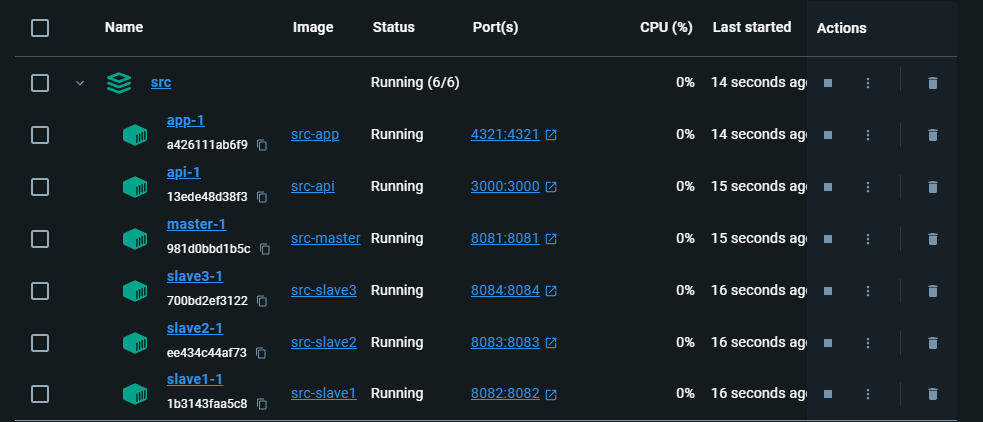

# Movies App Recomender with Golang using Distributed and Concurrent Programming

---



---

## Index

- [Movies App Recomender with Golang using Distributed and Concurrent Programming](#movies-app-recomender-with-golang-using-distributed-and-concurrent-programming)
	- [Index](#index)
	- [How to Use](#how-to-use)
	- [How it Works](#how-it-works)

---

<!-- How to use -->

## How to Use

1. Clone the repository

   ```bash
   git clone git@github.com:LuisFelipePoma/Movies_Recomender_With_Golang.git
   ```

2. Set up your `VITE_API_TMDB` in `src\docker-compose.yml`

   ```yml
   # App Web (FRONTEND)
   app:
     build:
       context: ./app
       dockerfile: Dockerfile
     environment:
       - VITE_API_URL=http://127.0.0.1:3000/api
       - VITE_API_TMDB=--YOUR-API-KEY--
     ports:
       - "4321:4321"
     networks:
       - app
     depends_on:
       - api
   ```

3. Run the next command to start the project in `src\`

   ```bash
   docker-compose --build up
   ```

## How it Works


